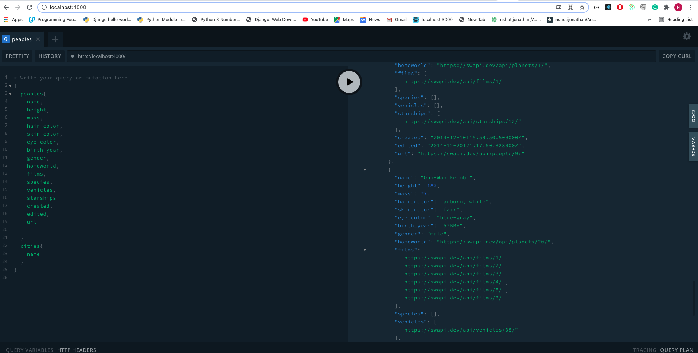
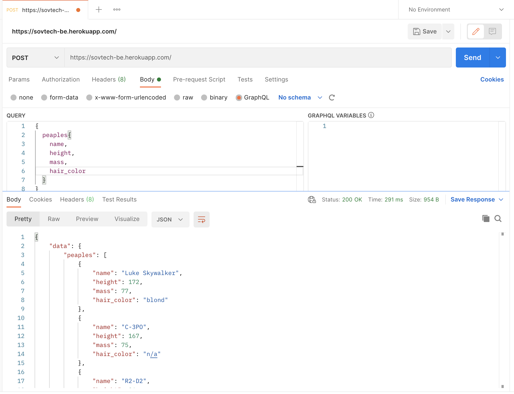

# sovtech-be
Apollo GraphQL API 


[API-HEROKU-LINK](https://sovtech-be.herokuapp.com/)

### Apollo Graphql Interface

### Postman Interface

### clone the Application

[Github](https://github.com/nshutijonathan/sovtech-be)

## Tools Used

### Language
```
*Typescript*
```
### Server Environment
```
 *NodeJS* 
 ```
 ### Deployment
```
 *Heroku* 
 ```

 ## Getting Started
These instructions will get you a copy of the project up and running on your local machine for development and testing purposes. See deployment for notes on how to deploy the project on a live system

## Prerequisites
To install the software on your local machine, you need first to clone the repository or download the zip file and once this is set up you are going to need this packages.

```
 [Node Package Installer - NPM] this usually comes with Node.
```

## SET NODE
TO setup the project on your local machine do the following
Install Node
```
npm install node
```


## Installing
The installation of this application is fairly straightforward, After cloning this repository to your local machine,CD into the package folder using your terminal and run the following

```
>npm install -g typescript
>npm install


Those commands will install the node_modules which will help you run the project on your local machine.
```
## Run the development server
```
> npm run dev
```

## Run the  production server
```
> npm run start
```

## Contributor
Jonathan Nshuti <nshutijonathan130@gmail.com>

---

## License & copyright
Jonathan NSHUTI

